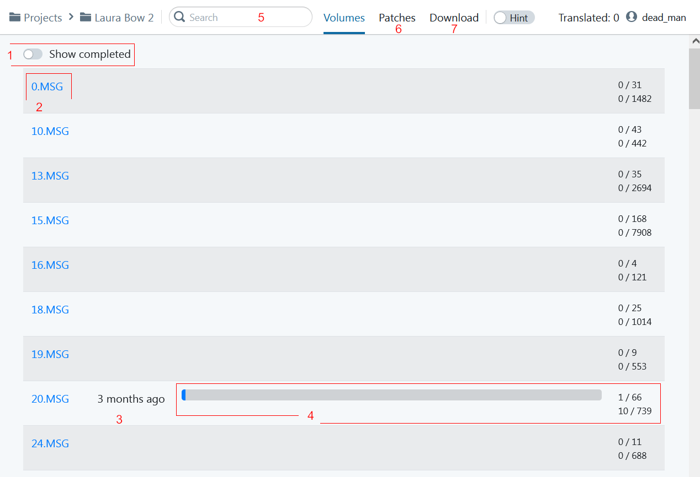

## Список проектов

1. Кнопка перехода в список проектов
2. Поиск текста по всем проектам
3. Включение подсказок (работает на странице перевода)
4. Количество переведённых символов
5. Меню пользователя (смена пароля и выход)
6. Карточка проекта. Нажатие - переход в проект

## Список глав

1. Отображение завершенных глав
2. Название главы. Нажатие - переход в главу
3. Время последнего редактирования перевода
4. Прогресс по главе. Количество переведённых строк и символов
5. Поиск текста по проекту
6. Добавление патчей ресурсов
7. Скачивание перевода

## Перевод главы

* Для добавление перевода нажать на стрелку (1) или двойной щелчок мышью по пустой области справа от текста
* Заполнить перевод и нажать `SUBMIT`. Либо `Cancel` для отмены редактирования.
* Для переноса исходного текста нажать двойную стрелку (6)
* Чтобы отредактировать перевод нажать левой кнопкой мыши по тексту (7)
* Для добавления комментария нажать кнопку комментирования (3)
* Для возврата в список глав нажать на название проекта в верхней части окна (4)
* В первом столбце таблицы указан номер строки (8), который является гиперссылкой на строку
* Во втором столбце указан номер персонажа который произносит текст (номера из одной главы могут не совпадать с номерами из другой)
* Включить/отключить подсказки к переводу можно переключателем `Hint` (5)

## Подсказки

При включенном переключателе `Hint` под текстом перевода появляются кадры видео-роликов с данным текстом. Изображение является гиперссылкой на ролик. В ссылке указан таймкод появления текста (минус 2 секунды)

## Редактирование перевода

В режиме редактирования можно посмотреть историю правок по нажатию на кнопку (1)